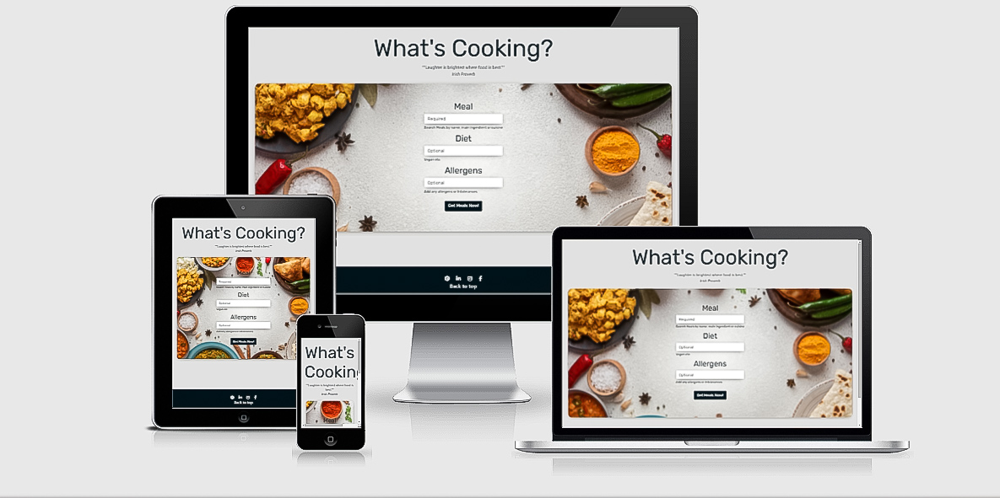
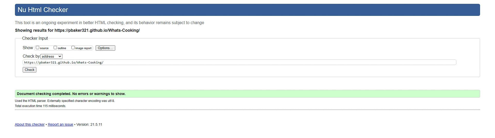
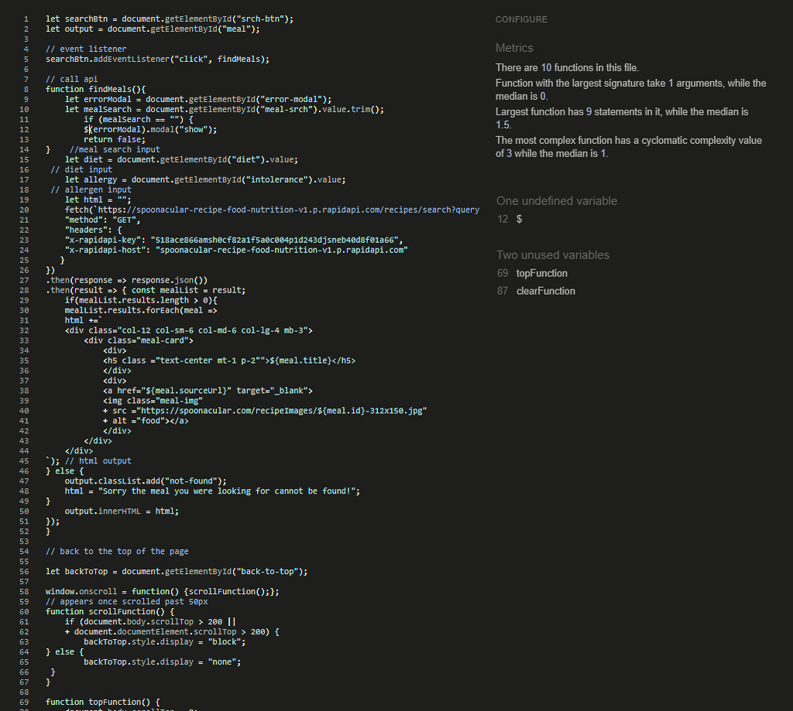
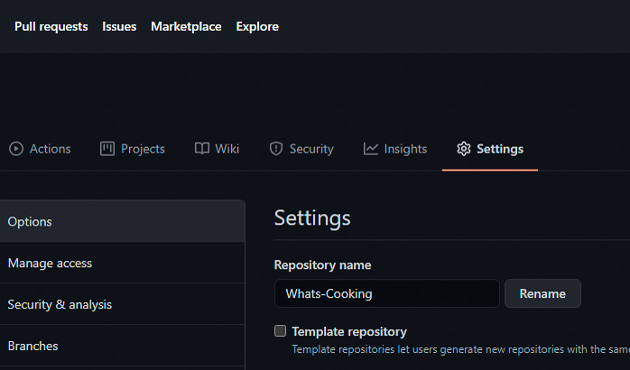
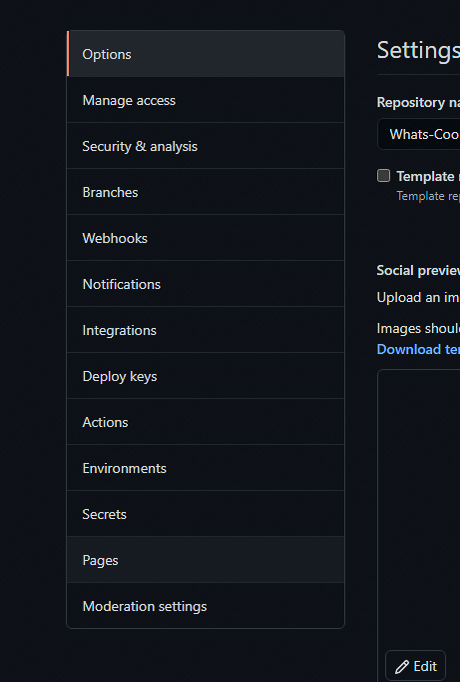
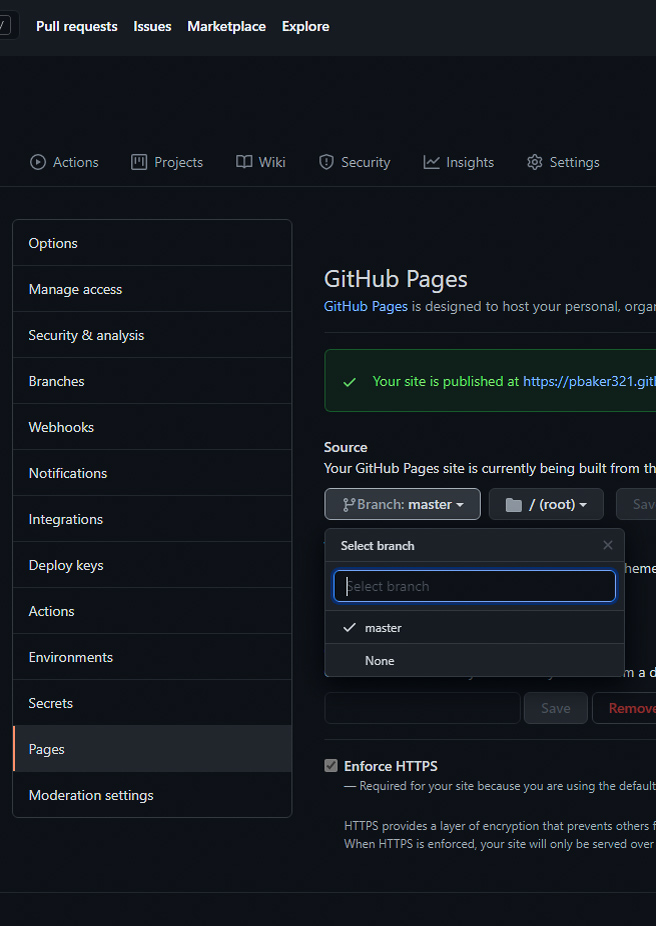
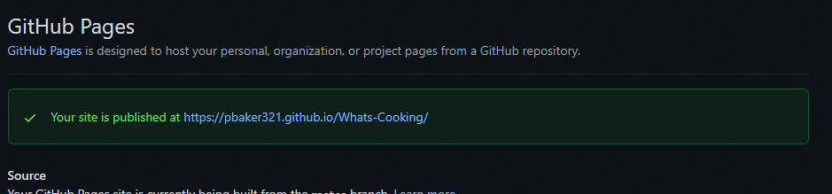
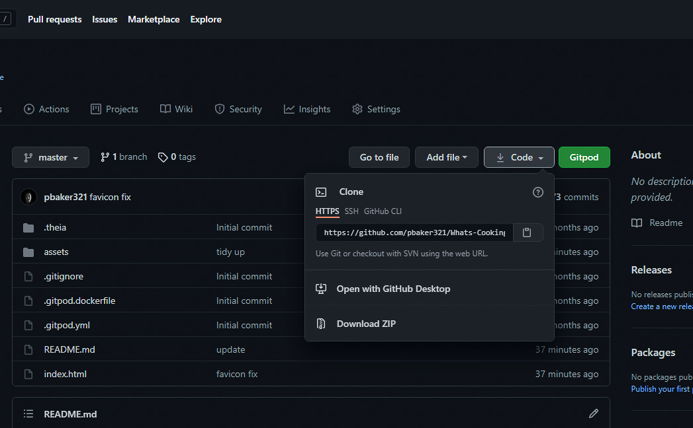

# What's Cooking? 

## Code Institute Milestone Project 2

A responsive website used as a recipe search. Recipes can found using either a main ingredient, a meal or cuisine through an API.
The user will also be able to search using specific requirements such as dietary needs, allergens and intolerance's.
The site can be built upon further by adding more features in the future, which could make it a complete weekly planner for cooking and food shopping.

The live version can be found [here](https://pbaker321.github.io/Whats-Cooking/)

## UX
  

The aim of the website is a recipe finder based on the user entering up to three details.
The more specific the user is the better results will return.  
This will give the user an easier way to find recipes based on their needs and wants

  

### Target Users
  

* Users looking for new recipes ideas
* Users with specific allergies or intolerance's
* Users interested in healthy food
* Users looking for different international cuisines
* Users looking new recipes based specific dietary requirements
* Users new to cooking
* Users that know how to cook
* Users who may want to change their diet
  

### User Stories

* As a User I want a clean and clear Website
* As a User I want to be able to navigate around the site with ease
* As a User I want to be able to use the website with ease with clear messages
* As a User I want to be able to find a wide arrange of recipes
* As a user I want to find new and random recipes using certain ingredients
* As a User I want to look for different international cuisines
* As a User I want to see different recipes for certain dishes
* As a User I want to find new and random recipes using certain dietary requirements
* As a User I want to find new and random recipes using certain intolerance's or allergens
* As a User I want to be able to see a image of the dish before seeing the recipe
* As a User I want to access recipes easily
* As a User I want to see an image of the recipe
* As a User I want to able to use the site on different platforms

  

The Wireframes can be found [here](https://www.figma.com/file/US5MHHxL12SBCDNVNIKVaU/Recipe-Site?node-id=0%3A1).

  

## Features

### Exsisting Features
  

**One page consisting of:**

1. landing - Hero image, Main Header and about a famous food quote
2. Meal input field for searching either
			  * Multiple ingredients
			  * Specific Cuisine
			  * Specific Dish
			  * Meals from a certain country or region
3. Diet input field for certain dietary requirements eg. Vegetarian or pescetarian.
4. Allergen input field where the user can specify any allergens or intolerance's
5. Each meal will have its title and image
6. Clicking on the the meal card (*will hover and pointer changes*) will redirect the user to the recipe website on a new tab
7. Input form will reset when user clicks on the Input
8. Results will refresh on new submit
9. Footer with links to Social Media
10. Back to top feature once a search has been made so the user can return to the search form.
11. Clear search button appear once a search has been made allowing the user to clear Results
12. Modal appears when the user doesn't fill in the Meal input query stopping the search.
13. Submit button which will return up to 10 results 

### Future Features

* Meal planner by inputting daily calories
* Shopping List creator based on saved recipes
* Wine pairing and recommendations
* User login for a search database so the user can save recipes
* Subscription for a mailing list for new recipes based on user searches
* Food blog
* Random recipe upon entering the site as a recipe of the day
  

## Technologies Used

*  [bootstrap4](https://getbootstrap.com/) - Layout & Responsiveness.
*  [HTML5](https://en.wikipedia.org/wiki/HTML5) - Content & Structure.
*  [CSS3](https://en.wikipedia.org/wiki/CSS) - Styling.
*  [JavaScript](https://en.wikipedia.org/wiki/JavaScript) - API
*  [Github](https://github.com/) - Hosting the site.
*  [Gitpod](https://www.gitpod.io/) - Developing the site.
*  [Freepix](https://www.freepik.com/) - Images.
*  [Fontawesome](https://fontawesome.com/) - Icons.
*  [Googlefonts](https://fonts.google.com/) - Fonts.
*  [RapidApi](https://rapidapi.com/) - API
* [Favicon](https://www.favicon.cc/) - Favicon
* [Chrome Developer Tools](https://developer.chrome.com/docs/devtools/) 
* [Jigsaw](https://jigsaw.w3.org/css-validator/) - CSS Validator
* [W3C](https://validator.w3.org/) - HTML Validator

## Testing

### HTML Testing &#9745;

### CSS Testing &#9745;

### JavaScript Testing &#9745;

An error found with $ on line 12.
This is because the modal is using bootstrap.

2 variables unused, but they are linked with the html.

### Browser Testing &#9745;

|   	|   **Chrome**	|   **FireFox**	|   **Opera**	|   **Edge**	|
|---	|---	|---	|---	|---	|
|   **API**	|   &#9745;	|   &#9745;	|   &#9745;	|   &#9745;	|
|   **Images**	|  &#9745; 	|  &#9745; 	|  &#9745; 	|  &#9745; 	|
|   **Links**	|   &#9745;	|   &#9745;	|   &#9745;	|   &#9745;	|
|   **Render**	|   &#9745;	|   &#9745;	|   &#9745;	|   &#9745;	|

### Responsive Testing
|   	|   	| 
|---	|---	|
|   **Desktop <1200px**	|  &#9745; 	|
|   **ipad Pro**	|  &#9745; 	| 
|   **ipad**	|   &#9745;	|
|   **iphone x**	|   &#9745;	| 
|	**iphone 5/SE**	|	&#9745;	|

### User Story Testing
* **As a User I want a clean and clear Website**
    * *Use of colors and contrast.*
    * *Light main picture*
    * *CLear of clutter and unnescesarry items*
* **As a User I want to be able to navigate around the site with ease**
    * *Single page site.*
    * *Clearly laid out.*
* **As a User I want to be able to use the website with ease with clear messages**
    * *Easy to use.*
    * *Clearly labeled.* 
* **As a User I want to be able to find a wide arrange of recipes**
    * *The range of recipes to find on API are vast.*
    * *Each Search will return a maximum of 10 results.* 
    * *The user can search by different countries.*
    * *The user can search by different & multiple ingredients.*
    * *The user can narrow down the search by adding dietary requirements.*
    * *The user can narrow down the search by adding allergens & intolerance's.*
    * *The user can search specific recipes.*
* **As a user I want to find new and random recipes using certain ingredients**
    * *The user can find recipes using a single ingredient* 
    * *The user can search by different & multiple ingredients.*
* **As a User I want to look for different international cuisines**
    * *The user can search by different countries.*
    * *The user can search by different cuisines.*
* **As a User I want to see different recipes for certain dishes**
    * *The user can search specific recipes.*
* **As a User I want to find new and random recipes using certain dietary requirements**
    * *The user can narrow down the search by adding dietary requirements.*
* **As a User I want to find new and random recipes using certain intolerance's or allergens**
    * *The user can narrow down the search by adding allergens & intolerance's.*
* **As a User I want to be able to see a image of the dish before seeing the recipe**
    * *Each result has an image which is the link to the recipe.*
* **As a User I want to access recipes easily**
    * *Each result has an image which is the link to the recipe.*
* **As a User I want to see an image of the recipe**
    * *Each result has an image which is the link to the recipe.*
* **As a User I want to able to use the site on different platforms**
    * *The site has been tested on different browsers.*
    * *The site has been tested for responsiveness.*

### Bugs

* **Empty input still returning default results**
	* An if statement to check if the input is equal to "" would return an error modal telling the user the input field is empty.
* **Default results returning when an invalid input is sent**
	* Change to the if statement on line 29. To check if the length is greater than 0.
* **No response if no recipe is found**
	* Change to the if statement on line 29. To check if the length is greater than 0.
* **Site had to be refreshed for new searches**
	* Clear search results button at the bottom of the results refreshes the page.
	* Old Results get replaced with new results on a new search.
	 

## Deployment
### Deploying the project

1. Go to Github
2. Go to repository
3. Click on settings

4. Go to the pages section(*Now has it's own tab*)

5. Under source click "none" and select "Master Branch".

6. Click save
7. Site address is here

### Run the code Locally

1. On Github, navigate to the main page of the repository.
2. Above the list of files, click Code.
3. Copy the URL on HTTPS by clicking the clipboard.

4. In your IDE of choice, open Git Bash.
5. Change the current working directory to the location where you want the cloned directory to be made.
6. Type git clone, and then paste the URL copied from Github.
7. Press enter and the local clone will be created.

## Credits

### Media

* The main image was sourced from [Freepix](https://www.freepik.com/)

### Content 

* The API was sourced from [RapidApi](https://rapidapi.com/)
* The form was built with [bootstrap4](https://getbootstrap.com/)
* The modal was built with [bootstrap4](https://getbootstrap.com/)

### Acknowledgements
* Precious Ijege my mentor
* [YouTube](https://www.youtube.com/) for all the tutorials and helping me understand 
* [Stackoverflow](https://stackoverflow.com/) for all the research and advice
* [w3schools](https://www.w3schools.com/)